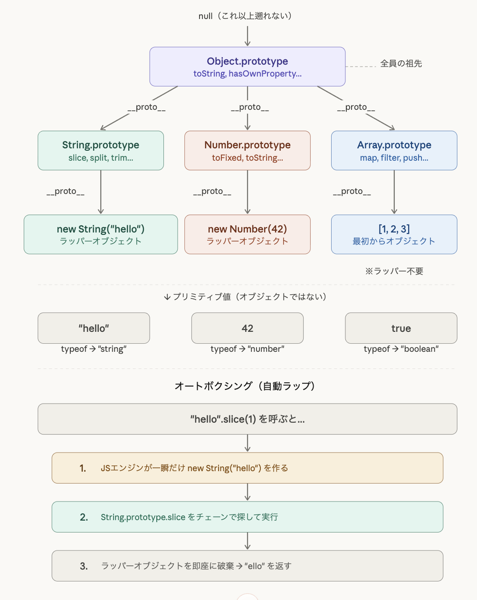

# JavaScript プロトタイプチェーンまとめ

## 「階層」ではなく「チェーン（鎖）」

JavaScriptのオブジェクトは、Java/C++のようなクラス階層ではなく、**プロトタイプチェーン**という仕組みでメソッドを共有している。

すべてのオブジェクトは `__proto__` という隠しリンクで1つ上の「プロトタイプ」を指しており、最終的に `Object.prototype` → `null` に行き着く。

## 登場人物の整理

| 用語                 | 何者か                             | 例                               |
| -------------------- | ---------------------------------- | -------------------------------- |
| コンストラクタ関数   | インスタンスを生成する関数         | `String`, `Number`, `Array`      |
| `.prototype`         | コンストラクタが持つメソッド置き場 | `String.prototype.slice()`       |
| ラッパーオブジェクト | プリミティブを包んだオブジェクト   | `new String("hello")`            |
| プリミティブ         | オブジェクトではない値             | `"hello"`, `42`, `true`          |
| `Object.prototype`   | チェーンの最後の砦                 | `toString()`, `hasOwnProperty()` |

## プロトタイプチェーンの探索

メソッドを呼ぶと、以下の順で探す：

1. **自分自身** のプロパティを探す
2. なければ **自分の `__proto__`**（= コンストラクタの `.prototype`）を探す
3. さらになければ **`Object.prototype`** を探す
4. それでもなければ **`undefined`** を返す

```javascript
"hello".hasOwnProperty("length");
// 1. "hello" 自身 → ない
// 2. String.prototype → ない
// 3. Object.prototype → 見つかった！
```

## オートボクシング（自動ラップ）

プリミティブ値（`"hello"`, `42`, `true` など）はオブジェクトではないため、本来 `__proto__` を持たない。

しかしメソッドを呼んだ瞬間、JSエンジンが裏で一時的にラッパーオブジェクトを作成し、プロトタイプチェーンを辿ってメソッドを実行、完了後すぐに破棄する。

```javascript
// "hello".slice(1) は内部的にこう動く：
// 1. new String("hello") を一瞬だけ作る
// 2. String.prototype.slice(1) を実行 → "ello"
// 3. ラッパーオブジェクトを破棄
```

### プリミティブ vs ラッパーオブジェクト

```javascript
const a = "hello"; // プリミティブ
const b = new String("hello"); // ラッパーオブジェクト

typeof a; // "string"
typeof b; // "object"

a === b; // false（型が違う）
a == b; // true（値は同じ）
```

**実務上 `new String()` / `new Number()` / `new Boolean()` を使う場面はほぼない。** 普段はプリミティブのまま使い、オートボクシングに任せればOK。

## 配列はラッパー不要

配列 `[1, 2, 3]` は最初からオブジェクトなので、ラッパーなしで直接 `Array.prototype` のチェーンを辿れる。

```javascript
typeof [1, 2, 3]; // "object"（最初からオブジェクト）
typeof "hello"; // "string"（プリミティブ → ラッパーが必要）
```
